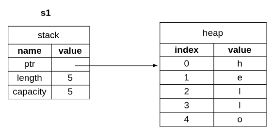
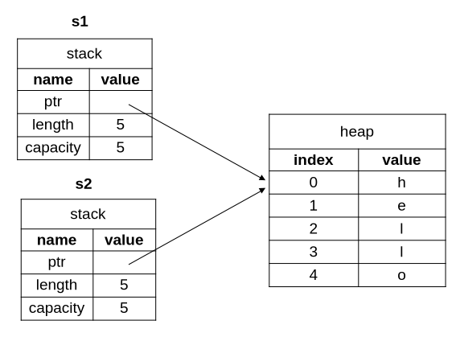
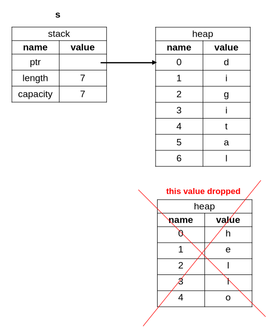

## What is Stack and Heap
Both the stack and heap are parts of memory where your program store data at runtime. They are structured in different ways to store data.
#### How data is stored on the stack
All data stored in the stack must have a fixed size at compile time. For example:
```
let x: i32 = 5;
```
this is a simple variable that store in stack, because we know there exact size that is 32 bit
```
let a: [i32; 5] = [1, 2, 3, 4, 5];
```
This array is stored on the stack because:  
* Array is fixed size → 5 elements, never changes
* Each element is i32 → 32 bits = 4 bytes each
So total space on stack:
```
5 elements × 32 bits = 160 bits = 20 bytes
```
Rust knows exactly how much space this array needs at compile time → so it goes on the stack

#### How data is stored on the heap
The heap is less organized. When you put data on the heap, you ask the memory allocator for some space. The memory allocator finds an empty spot in the heap, mark it as used and returns a pointer(memory address of that spot). The pointer itself is a fixed size, so it is stored on the stack.  
But when you want the actual data, you read the pointer from the stack, go to that memory address on the heap, and get the actual data there.  

The main purpose of ownership is to manage heap data. It keeps track of who owns the data, prevents unnecessary copies of the same data, and automatically frees the memory when it's no longer needed.

### String Literals
```
let s = "hello"
    ^      ^
    |      |
    |      |
    |     string literal
    | 
  this is a variable holds a string literal
```
#### What is string literal
A string literal is a text written directly in source code enclosed in double quotes (**""**). For example:
```
"hello"
"hello world"
```
#### Why are String Literals &str type?
```
let s: &str = "hello"
```
The actual text `hello` is of type `str` — but `str` has an unknown size at compile time. But rust need fixed known size at compile time to store value in stack.  

Solution - use reference **&str**. A reference (**&**) doesn't store the data itself — it stores:
* A pointer (memory address of string value) - fixed size (8 bytes on 64-bit systems)
* A length of string value - fixed size (8 bytes)

So **&str** is always a fixed size (16 bytes on a 64-bit system), no matter how long the actual string is. That's why rust put it in stack

#### Where is "hello" stored?
* `hello` is stored in the binary/executable file
* When you run the program, the OS loads this binary into memory, and `hello` store in a read-only data segment (sometimes called **.rodata**). This memory is not the stack, and not the heap — it's a separate region

### String Type
We’ve already seen string literals, where a string value is hardcoded into our program. But they aren’t suitable for every situation 
* **One reason :** they are immutable. so we can't grow or modify their content
  ```
   let s = "hello"     // we can't append text "hello" to "hello world"
  ```
* **Another reason :** not every string value can be known when we write our code. For example, what if we want to take user input and store it

So for these reason Rust has the **String** type. For example:
```
let s = String::from("hello");
                        ^
                        |
                        |
                        |
                      string literal 
```
This type manages data allocated on the heap and able to store an amount of text that is unknown to us at compile time  

This kind of string can be mutated: 
```
let mut s = String::from("hello");
s.push_str(" world");     // push_str() appends a literal to a String
println!("{s}");         // this will print "hello world"
```

## What is Ownership
Ownership is Rust’s most unique feature. It enables Rust to make memory safety guarantees without needing a garbage collector.  

Different programming languages manage memory in different ways. Some use a garbage collector that regularly check for no-longer-used memory and frees it at runtime, while others require programmers to manually allocate and free memory. Rust uses a unique ownership system where the compiler checks a set of rules at compile time. If any of the rules are violated, the program won’t compile.

### Ownership Rules
* Every value has an owner.
* A value can have only one owner at a time.
* When the owner goes out of scope, the value is dropped.

### Variable Scope
Scope is the block of code where a variable is valid and accessible. When a variable goes out of scope, Rust automatically calls a special function named `drop` to free the memory for that variable
```
        |--------{                    // scope start
scope   |          let s = "hello";   // s is valid from here 
        |          println!("{s}");   // s is valid and accessible
        |--------}                    // scope end - s is dropped 
                 // println!("{s}");  // Error: s is no longer available
```
When **s** comes into scope, it is valid. It remains valid until it goes out of scope.

### What happens when you assign one variable to another?
Now let’s look at the **String** version:
```
let s1 = String::from("hello");
let s2 = s1;
```
See what is happening here: 


> Figure-1

A **String** has 3 parts:
1) **Pointer** - a memory address, which points to where the string's data is stored
2) **Length** - how much memory (in bytes) the string's contents currently use
3) **Capacity** - the total amount of memory (in bytes) that the **String** has received from the allocator

This group of data is stored on the stack. On the right side is heap that holds the string's data    

####


> Figure-2

When we assign `s1` to `s2`, Rust copies the stack data (pointer, length, capacity) but does not copy the heap data ("hello") that the pointer points to. This is because copying heap data would be very expensive in terms of runtime performance if the data on the heap grows large.

### What is a double free error and how does Rust prevent it?
We know that when a variable goes out of scope, Rust automatically calls the `drop` function and cleans up the heap memory for that variable. But Figure-2 shows both data pointers pointing to the same location. This is a problem: When s2 and s1 go out of scope, they will both try to free the same memory. This is known as a **double free error** and is one of the memory safety bugs. Freeing memory twice can corrupt memory and cause security risks.  

To ensure memory safety, Rust treats `s1` as invalid after `let s2 = s1;`. Therefore, Rust doesn't need to free anything when `s1` goes out of scope. So if you try to use `s1` after `let s2 = s1;`, it won't work:
```
let s1 = String::from("hello");
let s2 = s1;

println!("{s1}, world!");
```
You'll get an error because Rust prevents you from using the invalidated variable."  

This concept is known as **move**. In this example, s1 move to s2. That solves our problem - only s2 is valid, so s2 will drop when it goes out of scope.

### What happens when you assign a completely new value to an existing variable?
When you assign a completely new value to an existing variable, Rust will call `drop` and free the original value from memory immediately. For example:
```
let mut s = String::from("hello");
s = String::from("digital");        // new value assign

println!("{s} world");              // it will print `digital world`
```

> Figure-3

* **hello** allocated on heap
* **digital** allocated on heap, **hello** is dropped immediately (inside scope, not at end of scope)
* prints **digital world**
* When the scope ends, the new value (**digital**) will be dropped also.